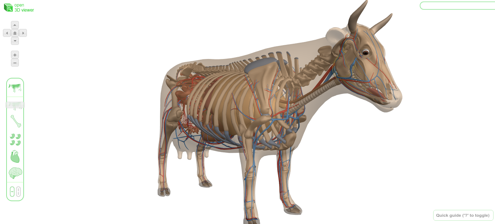

# Open 3D Viewer (Body Cow) - Google Labs

WebGL-based 3D object viewer with instant search. This project is used as the basis for Zygote Body and uses the webgl-loader mesh compression library.

[https://code.google.com/archive/p/open-3d-viewer/](https://code.google.com/archive/p/open-3d-viewer/)

